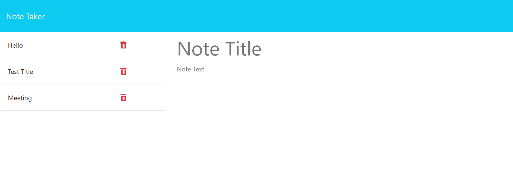

## Note Taking Application

## Description
This is a simple note taking application. Users who access this application can write their notes in the right-hand side of the screen and save them to a local database.

## Badges
N/A

## Visuals

Deployed Application: 

## Installation
This application is already deployed to heroku. To access it the user simply needs to click on the deployed application link above.

## Usage

## Contributing
N/A

## Authors and acknowledgment
This program was written by myself, Ida Whitcomb, with starter code supplied by UNH Coding Bootcamp.

## License
N/A

## Project status
This project is still in progress. It still needs a working delete route so that users can delete notes they no longer need.